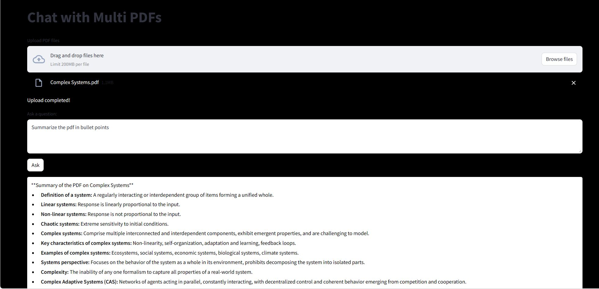

Gemini Multi PDF Chat with Streamlit
Gemini Multi PDF Chat with Streamlit is a Streamlit web application that allows users to upload PDF files and ask questions related to the content of those PDF files using the Gemini 1.0 Pro API. The application utilizes the Google Generative AI model to generate responses to user questions based on the provided PDF content.

Features
Upload PDF Files: Users can upload one or more PDF files containing the content they want to inquire about.
Ask Questions: Users can ask questions related to the content of the uploaded PDF files.
Response Generation: The application uses the Gemini 1.0 Pro API to generate responses to user questions based on the content of the uploaded PDF files.
Interactive Interface: The Streamlit interface provides an interactive and user-friendly experience for uploading files and asking questions.

Usage

Upload PDF Files:

Click on the "Upload PDF files" button to select one or more PDF files from your device.
Once the file(s) are uploaded, the application will display a message indicating that the upload is complete.

Ask a Question:

Enter your question in the text area labeled "Ask a question:".

Generate Response:

Click on the "Ask" button to generate a response based on the uploaded PDF content and the provided question.
The response will be displayed in the output section below.

To run the application locally, follow these steps:
clone this repo
cd your_repository
streamlit run chat_app.py

